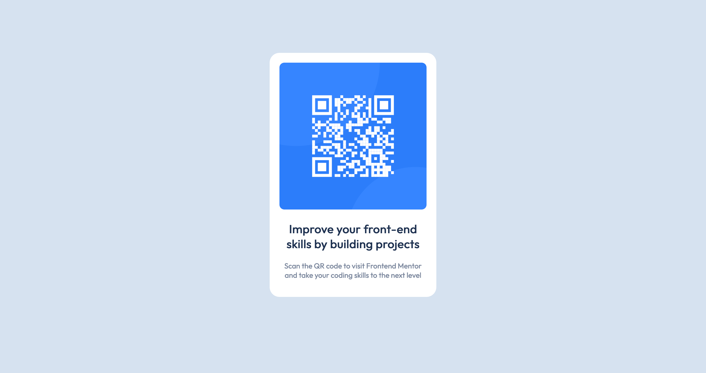

# Frontend Mentor - QR code component solution

This is a solution to the [QR code component challenge on Frontend Mentor](https://www.frontendmentor.io/challenges/qr-code-component-iux_sIO_H). Frontend Mentor challenges help you improve your coding skills by building realistic projects. 

## Table of contents

- [Overview](#overview)
  - [Screenshot](#screenshot)
  - [Links](#links)
- [My process](#my-process)
  - [Built with](#built-with)
  - [What I learned](#what-i-learned)
  - [Continued development](#continued-development)
- [Author](#author)

**Note: Delete this note and update the table of contents based on what sections you keep.**

## Overview

### Screenshot

### Links

- Solution URL: [Add solution URL here](https://your-solution-url.com)
- Live Site URL: [Add live site URL here](https://willmkee.github.io/frontendmentor-qr-code/)

## My process

### Built with

- Semantic HTML5 markup
- CSS custom properties
- Mobile first workflow

### What I learned

This was my first jump back into HTML and CSS in a few months if not longer. I reaquainted myself with the syling and specifically had to look back into media queries for making the website responsive.

### Continued development

I want to look back into CSS Flexbox and Grid and refresh myself on those aspects to make the responsiveness easier.

## Author

- Website - [William Kee](https://willmkee.github.io/)
- Frontend Mentor - [@willmkee](https://www.frontendmentor.io/profile/willmkee)

